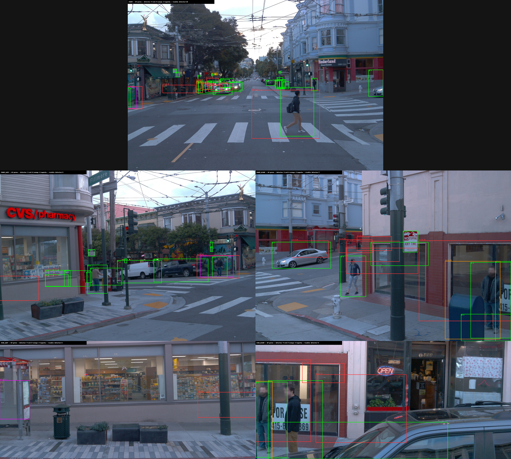

# DetZero Waymo Stage A `0013.png` 与全段错框根因分析

- 分析日期：2026-08-27
- 正式产物：`output/waymo-stage-a-release-b-20260827-122900-CST`
- 重点样例：`output/waymo-stage-a-release-b-20260827-122900-CST/visuals/0013.png`
- 辅助压力样例：`output/waymo-stage-a-release-b-20260827-122900-CST/visuals/0060.png`
- 既有报告：`docs/推理复现/DetZero-Waymo-Stage-A完成报告-20260827-133847-CST.md`
- 结论适用范围：上述单个 Waymo testing segment、冻结配置、冻结源码和冻结模型；不能外推为 DetZero 官方精度结论

## 1. 结论先行

### 1.1 能否改进

**能改，但当前产物不具备精度发布条件。原始 detector 输出本身已经不可靠；同时，`raw_predictions.npz` 又确实逐字段复现了这个 Open3D-ML checkpoint 的原生输出，因此不是文件损坏、adapter 或 renderer 把一组本来正确的框统一画错。下游再叠加无限寿命 Tracking、缺失 CRM、Pedestrian/Cyclist GRM 尺寸契约异常，以及 PRM 对零点裁剪无门控。**

直接回答“原始 detector 是否正确”：**整体不能认为正确，但也不是 `6,736` 个框全部错误。** 当前 segment 没有 `laser_labels`，不能计算官方 Waymo 3D AP/APH；不过 TFRecord 保留了 `11,688` 个逐相机 `projected_lidar_labels` 投影实例，可用于相机可见区域的部分真值一致性检查。本文因此同时使用原始点云、原始 detector 数组和投影标签；低 2D IoU 仍不自动等同于 3D false positive。

本次重新核对了 `0000.png` 至 `0198.png` 全部 `199` 张图：文件数、manifest 帧数和唯一 SHA-256 数均为 `199`，全部可解码为 `1280×640 RGB`。因此下面的“全段”不是抽帧观察。

### 1.2 主结论

1. **原始 PointPillars detector 本身已经包含系统性错误候选，不能作为“正确基线”。**
   - 全段 `6,736` 个原始框中，`1.1×` OBB 仍为零点的有 `1,238` 个（`18.38%`），点数不超过 `5` 的有 `2,635` 个（`39.12%`）；`199/199` 帧都至少含一个零点框。
   - 距 `x/y` 检测边界 `1 m` 内有 `349` 个框，其中 `283` 个为零点；同一个 Vehicle 框以毫米级相同的局部坐标、尺寸和分数在 `199/199` 帧重复出现，且始终位于空域边界。这是 detector 原生伪影，不是场景中固定目标。
   - `3,830` 个框可投影到至少一个相机；其中 `1,171` 个与任意类别投影标签的最大 2D IoU 都小于 `0.1`。同类最大 2D IoU 达到 `0.3/0.5` 的仅 `1,590/570` 个。该结果是部分真值健康检查，不是官方 3D precision/AP。
   - 仍有明确反例：`1,590` 个相机可见框能与同类投影标签达到 2D IoU `≥0.3`，所以“所有原始框都错”也不成立。

2. **右侧框数量的增加发生在 Tracking，不是 GRM/PRM 新建了目标。**
   - Detector：全段 `6,736` 个框。
   - Tracking 输出：`17,638` 个轨迹观测，其中仅 `4,987` 个是当前帧检测命中（`hit=1`），`12,651` 个是 Kalman 预测状态（`hit=0`），预测占 `71.73%`。
   - GRM、PRM 和最终合并均保持同一轨迹、同一帧、同一观测数量，最终仍为 `17,638` 个框。

3. **用户指定的 0013 帧已经在 Detector 端有噪声，Tracking/Refinement 又系统性放大。**
   - 左侧 Detector 为 `32` 框，右侧 Final 为 `66` 框，净增 `34`，达到 `2.06×`。
   - 右侧仅 `25` 框是当前检测命中，`41` 框是 `hit=0` 预测，占 `62.12%`；其中 `10` 框距最近命中至少 `5` 帧，`1` 框至少 `10` 帧。
   - 按生成时相同的 `1.1×` 3D OBB CUDA 裁点语义，Detector 有 `6/32` 个零点框；Tracking 有 `15/66` 个零点框；PRM 的 `5` 个 `>2 m` 修正全部来自零点输入，其中 `2` 个超过 `5 m`。
   - 例：Vehicle track `23` 在当前帧虽然 `hit=1`，但扩大框内仍为 `0` 点；PRM 把其 LiDAR 中心从约 `[-74.082, 71.149, 5.329] m` 移到 `[-93.624, 68.326, 4.934] m`，位移 `19.748 m`。这不是 renderer 画歪，而是正式 Final 数值已经被移走。
   - 例：Pedestrian track `29` 也是当前帧 `hit=1`，GRM 把尺寸从约 `1.049×1.014×1.747 m` 改成 `6.155×2.279×1.593 m`，直接生成车辆尺度的行人框。

4. **这不是 0013 单帧偶发，而是 199 张图一致暴露的流水线模式。**
   - `195/199` 帧 Final 框多于 Detector；每帧 Final/Detector 倍数中位数为 `2.655×`。
   - `197/199` 帧含 Tracking 预测框，`178/199` 帧含距最近命中至少 `10` 帧的陈旧预测。
   - `199/199` 帧都有至少一个 Detector 零点框、至少一个 Final 零点框和至少一个 PRM `>2 m` 修正。
   - 这能确认异常机制贯穿全段，但由于没有官方 3D GT，不能把其余有点支持框也统称为误检。

5. **Pedestrian/Cyclist GRM 存在已落到正式产物上的配置—检查点语义不兼容。**
   - Pedestrian 的 `981/981` 个观测都被大幅改成接近车辆的尺寸：输入尺寸中位数约 `0.957 × 0.878 × 1.773 m`，GRM 输出中位数约 `4.940 × 1.913 × 1.593 m`，体积中位数放大 `9.109` 倍。
   - Cyclist 的 `351` 个观测，输入尺寸中位数约 `1.549 × 0.825 × 1.813 m`，输出中位数约 `3.639 × 1.620 × 1.651 m`，体积中位数放大 `3.788` 倍。
   - Vehicle 的尺寸总体稳定，体积比中位数为 `0.984`。问题明显集中在行人/骑行者路径。
   - 行人和骑行者 GRM YAML 没有声明 `ANCHOR_SIZES`，解码器会回退到包含车辆尺寸的默认锚框；正式输出又证明模型实际频繁选择了车辆尺度。当前证据能确认这是一个产品影响缺陷，但尚不能仅凭现有文件断言是上游 YAML 错误、下载的 checkpoint 错配，还是两者共同造成。

6. **PRM 对无点云证据的框仍执行网络回归，产生了大量异常大位移。**
   - 按正式裁剪代码完全相同的 `1.1×` 3D OBB 语义独立重算，`17,638` 个轨迹观测中有 `2,820` 个零点裁剪，占 `15.99%`。
   - PRM 相对 Tracking 中心位移大于 `2 m` 的有 `937` 个；大于 `5 m` 的有 `482` 个；大于 `10 m` 的有 `295` 个。
   - `937` 个大于 `2 m` 的异常修正中，`712` 个（`75.99%`）当前裁剪为零点；在当前帧 `hit=1` 检测关联的异常修正中，这一比例为 `258/286 = 90.21%`。
   - 零点裁剪会被补成全零点数组，当前实现没有对应的“点证据有效”掩码，PRM 仍把它当作正常输入。

7. **当前正式路径明确没有 CRM，且最终分数只是 Tracking 分数原样透传。**
   - 所以长时间预测框不会因为 miss 次数增加而自动降权，也没有 DetZero 的 Confidence Refining Model 对轨迹置信度重新排序或抑制。
   - CRM 能否解决多少误检尚未验证；但当前 `no CRM + score passthrough` 确实使低置信和陈旧预测缺少最后一道置信过滤。

### 1.3 推荐路线

按风险和工作量排序：

1. **立即停止对 Pedestrian/Cyclist 使用当前 GRM 结果**，先回退到 Tracking 原尺寸；同时让每个类别的 GRM 配置必须显式声明并校验 checkpoint 匹配的锚框，禁止隐式默认值进入正式推理。
2. **给 PRM 增加 fail-closed 回退**：记录每个观测的裁剪点数、修正位移和是否采用修正；零点/低证据且修正超限时保留 Tracking 中心和朝向，不允许无证据的大位移直接进入产品。
3. **区分“内部完整轨迹”和“对外发布框”**：Tracking 可继续保留长轨迹供离线 refinement 使用，但渲染和最终标签不得无差别发布所有 `hit=0` 状态；先用 `hit`、距最近命中的帧数、点支持和校准后的置信度建立发布策略。
4. **在有 3D `laser_labels` 的 Waymo validation 段上做单变量 A/B**，校准 detector 分数阈值、最大预测间隔、PRM 回退界限和 CRM；没有官方 3D 指标前，不把“框少了”写成精度改善。
5. **重做诊断图口径**：至少分别显示 `Detector`、`Tracking hit=1`、`Tracking hit=0`、`GRM/PRM accepted/fallback`；左右面板使用相同的显示阈值，并分别标注总框数和视野内框数。

不建议直接采用以下做法：

- 一次性关闭全部 Tracking 预测框；这会同时丢掉遮挡恢复和单帧漏检补全能力。
- 只把 score threshold 从 `0.1` 提高到某个拍脑袋值；它会减少框，但尚未证明精度/召回更好。
- 只根据 `0013.png` 或 `0060.png` 判定每一个右侧框为误检；当前 testing 段没有 3D `laser_labels`，部分投影真值也没有覆盖完整 Final，且部分预测框仍有明显点云支持。
- 继续调 GRM/PRM 之前忽略行人/骑行者尺寸和零点输入问题；这两项已经是比阈值微调更靠前的契约缺陷。

## 2. 分析口径与证据等级

### 2.1 权威证据

本报告优先使用正式产物内的生成时证据：

- `run_metadata.json`、`run_ledger.json`、各阶段 manifest 和日志；
- `adapter/detzero_result.pkl`、`tracking/tracking.pkl`；
- `refining/result/*_{geometry,position}.pkl`；
- `final/final_frame_grm_prm_score_passthrough.pkl`、`final/final_arrays.npz`；
- `visuals/render_manifest.json`；
- `source_bundle/files/` 内冻结的生成时源码与配置；
- `data/waymo/waymo_processed_data/.../*.npy` 中本次正式运行使用的点云。

本次 detector 专项复核还只读解析了正式输入 TFRecord 中的 `projected_lidar_labels`，并新增两份**发布后诊断附件**：

- `docs/推理复现/assets/DetZero-Waymo-detector-raw-audit-20260827.json`：原始框点支持、投影一致性和原生复跑摘要；
- `docs/推理复现/assets/DetZero-Waymo-detector-0013-camera-projection.png`：0013 五相机投影对照，绿色为 Waymo 投影标签，红/橙/紫为 detector 的 Vehicle/Pedestrian/Cyclist。

这两份附件不属于原冻结 Stage A source bundle，不能反向升级其发布 verdict；它们只补充解释原始 detector 是否正确。

当前工作树已有大量与本报告无关的修改和未跟踪产物；本文没有用当前可变源码替代冻结实现来解释正式结果，也没有修改正式 Stage A 目录。

### 2.2 证据等级

| 结论 | 已实现 | 正式配置可达 | 正式产物已触发 | 影响最终产品 | 单变量因果复跑 | 判定 |
| --- | ---: | ---: | ---: | ---: | ---: | --- |
| Tracking 长间隔预测造成框数增加 | 是 | 是 | 是 | 是 | 数量代数已直接闭合 | **确认：框数主因** |
| Ped/Cyclist GRM 输出车辆尺度 | 是 | 是 | 是 | 是 | 未做替换 A/B | **确认：产品影响缺陷；精度影响待 A/B** |
| 零点裁剪与 PRM 大位移强相关 | 是 | 是 | 是 | 是 | 未做掩码 A/B | **高置信根因；因果幅度待 A/B** |
| 无 CRM、分数透传使陈旧框未降权 | 是 | 是 | 是 | 是 | 未执行 CRM 对照 | **确认当前缺口；CRM 收益待验证** |
| Detector `0.1` 阈值保留低分空域锚框 | 是 | 是 | 是 | 是 | 未做阈值 A/B | **确认输入噪声；最佳阈值待标定** |
| `raw_predictions.npz` 是否忠实保存原生模型输出 | 是 | 是 | 是 | 是 | 0000 帧原生复跑逐字段 bitwise 相等 | **已确认：artifact 未损坏** |
| 原始 detector 是否已有可观测质量问题 | 是 | 是 | 是 | 是 | 199 帧点支持 + projected labels 独立复核 | **已确认：不应视为正确基线** |
| checkpoint-era 配置/推理代码不匹配 | 否 | 否 | 未观察到 | 否 | 配置字节相同，关键推理函数 AST 相同 | **排除为当前主因** |
| 反向 tracking 单独制造了 0060 新框 | 是 | 是 | 全段无 `hit=2` 或 pre-birth 保留观测 | 正式产品贡献为 0 | 未做关闭对照 | **排除为本代框数来源** |
| GRM/PRM 或最终合并重复创建对象 | 否 | 否 | 否 | 否 | 数量/ID 对齐已验证 | **排除** |

### 2.3 “第一处错误”按症状拆分

不存在一个能解释所有现象的单一首错点；逐症状最早发生阶段如下：

| 可见症状 | 最早出现阶段 | 判定 |
| --- | --- | --- |
| 左图已有低分、零点或边界候选 | PointPillars Detector | **已确认系统性错误候选；完整 3D FP 比例待 validation GT** |
| 右图框数约为左图 2–3 倍 | Tracking | **已确认：无限寿命轨迹内部预测是数量主因** |
| 行人/骑行者变成车辆/公交尺度 | GRM | **已确认：类别配置/检查点解码契约异常** |
| 框从点簇附近跳走数米到二十米 | PRM | **已确认大位移；与零点输入高度重合** |
| 低分/陈旧框仍原分数发布 | no-CRM final combine | **已确认：最后置信门缺失** |
| 左右框被统一画歪 | adapter/renderer | **现有几何 canary 与逐框对账不支持，已排除全局转换错误** |

所以最短修复不能只改一个 yaw 公式或只调一个 score：先阻断 GRM/PRM 的确定性异常和 stale state 发布，再用有 GT 数据选择 detector/tracker 阈值。

## 3. Detection → Tracking → GRM → PRM 的真实数据流

```text
Open3D-ML PointPillars
  199 帧 / 6,736 个检测框 / score floor 0.1
        |
        v
DetZero adapter
  只做类别、尺寸顺序、yaw、帧/pose 契约转换；不增加框
        |
        v
DetZero Tracking
  331 条最终保留轨迹 / 17,638 个逐帧观测
  - hit=1: 4,987（当前帧检测命中）
  - hit=0: 12,651（Kalman 预测）
        |
        +--> GRM：只替换每个既有观测的 l,w,h
        |
        +--> PRM：只替换每个既有观测的 x,y,z,yaw
        |
        v
无 CRM 合并
  score 原样透传；观测数仍为 17,638
        |
        v
两面板渲染
  左：Detector 全框
  右：所有 Tracking 观测经 GRM+PRM 后的框；无 hit/预测/score 过滤
```

冻结合并代码明确执行：

- `final[:, :3] = PRM center`；
- `final[:, 3:6] = GRM dimensions`；
- `final[:, 6] = PRM heading`；
- velocity 和 score 继承 Tracking；
- GRM/PRM 与 Tracking 必须保持相同 frame ID、score 和数组长度。

因此右侧框多不能归因于 GRM/PRM“增加检测”。Refinement 的问题是把既有框放大或移到不合理位置，从而让 Tracking 产生的额外框更显眼、更像误检。

## 4. 0013 帧与全段量化

### 4.1 0013 帧：用户指定图片

`visuals/render_manifest.json` 对 `0013.png` 的正式记录，以及 tracking/refining 中间产物的逐框对账如下：

| 项目 | 数量 |
| --- | ---: |
| 点数 | 196,259 |
| Detector 框 | 32 |
| 右侧 Final 框 | 66 |
| Tracking 当前命中 `hit=1` | 25 |
| Tracking 预测 `hit=0` | 41 |
| Final Vehicle / Pedestrian / Cyclist | 60 / 4 / 2 |
| 预测中距最近命中至少 5 / 10 帧 | 10 / 1 |
| Detector / Tracking / Final 的 `1.1× OBB` 零点框 | 6 / 15 / 12 |
| PRM 中心位移 `>2 m` / `>5 m` | 5 / 2 |

对 0013 的**原始 32 个 detector 框**再用 Waymo rolling-shutter 相机模型投影，并与该帧 `projected_lidar_labels` 对照：

| 原始 detector 投影检查 | 数量 |
| --- | ---: |
| 可见于至少一个相机 | 21 / 32 |
| 同类别最大 2D IoU `≥0.3` | 8 / 21 |
| 同类别最大 2D IoU `≥0.5` | 0 / 21 |
| 任意类别最大 2D IoU `≥0.3` | 11 / 21 |
| `1.1× OBB` 零点框 | 6 / 32 |



图中绿色为 Waymo 投影标签；红、橙、紫分别为原始 detector 的 Vehicle、Pedestrian、Cyclist 投影框。可见部分框与标签有合理重合，另一些明显偏移、重复或尺寸不符。这同时反驳了“全部正确”和“全部错误”两个极端判断。投影检查不是 Waymo 3D AP/APH，也未做一对一匹配，只作为相机可见区域的部分真值健康检查。

数量闭合为：`25 observed + 41 predicted = 66 Final`。相对左侧 `32` 个 Detector 框，右侧净增 `34`；这不是 refinement 创建了 34 个对象，而是当前 Detector 中有 7 个框没有进入最终保留轨迹，同时 Tracking 发布了 41 个当前帧没有检测命中的状态：`32 - 7 + 41 = 66`。现有正式产物不足以把这 7 个再可靠分解为 overlap/关联/后处理各自删除多少个，因此不猜测。

`0013.png` 中最显眼的两类几何异常也能从数值直接复现：

- Vehicle track `23`：当前检测命中、score `0.1228`，但扩大 OBB 内为零点；PRM 中心位移 `19.748 m`，且移出 `±80 m` 的渲染范围。
- Pedestrian track `29`：当前检测命中、score `0.1293`，尺寸体积被 GRM 放大约 `12.02×`，输出长 `6.155 m`；这解释了右图中“行人颜色、车辆大小”的框。
- Cyclist track `86`：`hit=0`、距命中仅 1 帧，尺寸仍由 `2.954×1.039×1.837 m` 变为 `10.475×2.461×3.080 m`，体积约放大 `14.09×`。所以该类异常不能只归咎于长时间 Kalman 漂移。

这里仍要区分“无点证据”“2D 投影不一致”和“官方 3D 真值误检”：前两者是强异常证据，但完整 precision/recall 仍必须用带 `laser_labels` 的 Waymo validation 评价，不能从 BEV 截图或本次部分投影检查直接替代。

### 4.2 0060 帧：辅助压力样例

`visuals/render_manifest.json` 对 `0060.png` 记录：

| 项目 | 数量 |
| --- | ---: |
| 点数 | 184,002 |
| Detector 框 | 52 |
| 右侧最终框 | 126 |
| Tracking 当前命中 `hit=1` | 36 |
| Tracking 预测 `hit=0` | 90 |
| 最终 Vehicle / Pedestrian / Cyclist | 117 / 8 / 1 |
| 当前命中 Vehicle / Pedestrian / Cyclist | 35 / 1 / 0 |

进一步按真实执行分支对账：

- 52 个 Detector 框中，overlap filter 先删除 2 个 Pedestrian，tracker 实际输入 50 个框；
- 最终 36 个 `hit=1` 由 34 个既有轨迹的一阶段匹配和 2 个当前帧新生 Vehicle 组成；
- overlap 后还有 14 个当前检测未进入最终后处理轨迹，正式产物没有保存足够的 pre/post-process 中间状态，不能再可靠拆分其具体删除原因；
- 完整等式为：`52 - 2 - 14 + 90 = 126`。

预测框离最近检测命中的距离：

| 条件 | 0060 预测框数 |
| --- | ---: |
| 至少 2 帧 | 66 |
| 至少 3 帧 | 48 |
| 至少 5 帧 | 32 |
| 至少 10 帧 | 21 |
| 至少 20 帧 | 8 |
| 至少 40 帧 | 1 |

这说明 0060 的右侧不是“当前帧检测 + 少量一两帧补全”，而是包含相当数量的长间隔历史轨迹状态。

### 4.3 相邻帧不是偶发现象

| 帧 | Detector | Final | 倍数 |
| ---: | ---: | ---: | ---: |
| 0058 | 45 | 127 | 2.82× |
| 0059 | 51 | 126 | 2.47× |
| 0060 | 52 | 126 | 2.42× |
| 0061 | 34 | 125 | 3.68× |
| 0062 | 57 | 125 | 2.19× |

全段每帧 Final/Detector 倍数的中位数为 `2.655×`，P90 为 `3.362×`，最大为 `5.2×`（0104 帧，`20 -> 104`）；199 帧中有 195 帧 Final 多于 Detector，另 4 帧 Final 少于 Detector。总量比为 `17,638 / 6,736 = 2.618×`。0060 的绝对框数很高，但 `2.423×` 低于全段倍率中位数，说明它是系统性增密在繁忙帧上的显著表现，而不是唯一异常帧。

### 4.4 Tracking 为什么会填出这么多框

冻结配置和代码共同给出以下行为：

- `DEATH_AGE = -1`：轨迹不会因为连续 miss 被删除；
- 当前 `KalmanFilter` 输出分支不会用 `BIRTH_AGE` 限制发布，因此配置中的 `BIRTH_AGE = 1` 不是本次有效过滤门槛；
- 二阶段关联的三类 `SCORE_THRESHOLD` 都是 `0.1`，`POINT_THRESHOLD` 都是 `0`，点支持不构成拒绝门槛；
- `LEAST_AGE = 5`：后处理只要求整条轨迹累计至少 5 个命中；
- 后处理裁掉首尾非命中状态，但保留首个命中与最后命中之间的全部内部预测；
- 因而一个只有少量、相隔很远命中的轨迹，也会被展开成中间每一帧都有框的完整时间序列。

331 条最终轨迹的长度中位数为 `37` 帧，但命中数中位数只有 `9`。内部最大连续预测间隔的中位数为 `12` 帧，P90 为 `55` 帧，最大达到 `140` 帧。这与 `12,651` 个预测观测完全一致。

0060 的 object `49` 是极端例子：上一次 `hit=1` 在 0007，下一次在 0108，0060 时已经连续 miss 53 帧；但整条轨迹累计有 6 次命中，刚好越过 `LEAST_AGE=5`，所以未来命中使这个内部空洞仍被后处理保留。

这套策略符合离线 auto-labeling “优先补全时序、再由 confidence refinement 处理”的思路，但它依赖更强、更匹配的 detector 和后续 CRM。把它直接接在当前低阈值单帧 PointPillars 上，并取消 CRM，会明显放大检测噪声。

## 5. 根因一：原始 detector 模型输出自身不达标，而非 artifact/adapter 损坏

### 5.1 全 199 帧原始框的质量证据

当前 detector 是外接的**单帧** Open3D-ML PointPillars，不是 DetZero 官方完整路线使用的多帧 detector。正式配置 `score_thr=0.1`；全段分数中位数只有 `0.1541`，`3,216/6,736 = 47.74%` 的框低于 `0.15`，`4,595/6,736 = 68.22%` 低于 `0.20`。低阈值本身不是代码错误，但它把模型的大量低置信候选直接交给了 tracker。

点云健康检查结果：

| 条件 | 原始 detector 框数 | 占比 |
| --- | ---: | ---: |
| 原尺寸 OBB 内为零点 | 1,468 / 6,736 | 21.79% |
| `1.1×` OBB 内仍为零点 | 1,238 / 6,736 | 18.38% |
| `1.1×` OBB 内不超过 5 点 | 2,635 / 6,736 | 39.12% |
| 中心距 `x/y` 边界 1 m 内 | 349 / 6,736 | 5.18% |
| 中心落在模型 z 范围 `[-2,4] m` 外 | 674 / 6,736 | 10.01% |

边界框中 `283/349` 个扩大后仍为零点；z 中心越界框中 `487/674` 个扩大后仍为零点。更强的反例是一个 Vehicle 框在 `199/199` 帧都以相同局部坐标约 `[-74.082, 71.149, 5.329] m`、相同尺寸约 `[5.211, 2.281, 1.670] m` 和约 `0.123` 分数出现。车辆坐标系随自车运动，真实世界目标不可能在 199 帧都锁死于同一局部空域边界；这是原生 detector 的稳定伪影。

当前 testing TFRecord 没有 3D `laser_labels`，但有 `11,688` 个 `projected_lidar_labels` 投影实例：Vehicle `3,591`、Pedestrian `5,194`、Sign `2,903`、Cyclist `0`。使用 Waymo rolling-shutter `world_to_image` 将原始 3D 框投影到五相机，得到：

| 相机可见原始框检查 | 数量 | 占可见框 |
| --- | ---: | ---: |
| 至少可见于一个相机 | 3,830 | 100% |
| 同类别最大 2D IoU `≥0.3` | 1,590 | 41.51% |
| 同类别最大 2D IoU `≥0.5` | 570 | 14.88% |
| 任意类别最大 2D IoU `<0.1` | 1,171 | 30.57% |
| 零点且任意类别最大 2D IoU `<0.1` | 392 | 10.23% |

另有 `118` 个 camera-visible Cyclist 预测，而本段没有任何 Cyclist 投影标签；它们在这份部分真值下至少属于类别不一致或假阳性。另一方面，score `≥0.5` 的可见框中有 `61/86 = 70.93%` 达到同类 2D IoU `≥0.3`，说明较高分框总体更可信，也证明不能把全部原始输出一刀切为错误。

这些投影数值没有一对一匹配，也不是官方 3D AP/APH；框的部分可见、深度误差和标签投影都会影响 2D IoU。因此本文只据此确认“原始结果存在大规模质量问题”，不把 `2,240` 个同类 IoU `<0.3` 的可见框逐一宣布为 3D false positive。

### 5.2 原始 artifact 忠实复现模型；未发现 checkpoint/runtime 推理错配

为区分“模型本身输出差”和“runner 把模型跑错”，执行了最小单帧差分：

1. 按 Open3D-ML 原生测试路径执行 `model.preprocess -> model.transform -> ObjectDetection.run_inference`；这与冻结 runner 的调用顺序一致，不存在 double preprocess 或漏 transform。
2. 对 0000 帧重新加载同一 config/checkpoint 推理，所得 `30` 个框的 `center/size/yaw/score/label` 与正式 `raw_predictions.npz` **逐字段 bitwise 相等**，最大数值差均为 `0`。
3. 运行时 `pointpillars_waymo.yml` 与 checkpoint model-zoo 所在提交 `66131df0...` 的配置字节相同，SHA-256 均为 `a9360f7994e577beed4858a19f522d0685bd03d70a80a079f38b126373055666`。
4. 对 checkpoint-era `66131df0...` 与当前 Open3D-ML `fcf97c07...` 的 preprocess、voxelize、forward、decode、NMS 等关键推理函数做 AST 对比，全部相同。PR #602 修改的是训练 target assignment，不支持把它列为本次冻结推理的根因。
5. 从原 TFRecord 独立重建的 `[x,y,z,intensity]` 与正式输入是完全相同的点多重集。当前预处理采用 lidar-major、上游脚本采用 return-major 顺序；0000 帧两种顺序产生相同的 `12,525` 个 voxel 坐标集合，按类别匹配后的预测中心中位差为 `0`，最大差约 `0.062 m`。这个顺序差应在下次正式接入时统一，但单帧 A/B 不支持其解释当前全段错框。

所以 `raw_predictions.npz` 的机械正确性与 detector 的精度正确性必须分开：**文件和调用链是正确的，模型在当前工作点给出的结果不够正确。**

### 5.3 未发现全局尺寸、中心或 yaw 转换错误

- Open3D-ML 输出 `BEVBox3D.size=[width,height,length]` 和几何中心；冻结 adapter 重排为 `[length,width,height]`，并执行 `heading=wrap(-yaw-π/2)`。
- `adapter_manifest.json` 写明同一契约；adapter 前后均为 `6,736` 个框，不创建对象。
- renderer 直接读取 adapter/final 的 `boxes_lidar` 后调用同一个绘框函数，不再次交换尺寸、移动中心或改 yaw。
- 非方形框 canary 与角点等价测试已覆盖尺寸/yaw。投影对照也明确排除了把中心误当 box bottom：将 z 下移 `h/2` 后，选取的 9 帧中同类 2D IoU `≥0.3` 从 `66` 降到 `44`。其余 yaw/长宽变体在 2D 投影上区分度不足，不能替代既有 3D 几何 canary。
- 输入侧没有证据支持“漏做 `tanh(intensity)`”是主因：冻结 detector 与 Open3D-ML Waymo 预处理都使用原始 range-image intensity；`tanh` 属于后续 DetZero object-centric refining 输入处理。

### 5.4 根因优先级与最小安全路线

原始 detector 的首要问题是**模型能力和工作点**：较旧的单帧 checkpoint、`0.1` 低阈值和边界锚框伪影共同产生了低质量候选。Open3D-ML 对该 checkpoint 公布的 best 3D mAP 为 `57.55`（IoU `0.5`）；这不是坏权重证明，但不足以假设它能直接提供 DetZero refining 所需的高质量完整 tracks。DetZero README 的完整上游行报告 `76.24 mAPH_L2`，两者指标定义不同，不能直接相减。

最小安全路线不是继续改 yaw，也不是先写新 detector：

1. 将当前原始 detector 标为**诊断基线，不可发布**；保留本次 raw artifact，避免用下游过滤掩盖上游问题。
2. 在带 `laser_labels` 的 Waymo validation 上直接计算当前 detector 的官方 AP/APH，并按类别、距离和 score 分桶；阈值必须从 PR 曲线选择，不根据 0013 拍值。
3. 复用仓库已有 CenterPoint/DetZero 兼容 detector 路线，完成版本、checkpoint 和许可证审查后，与当前 PointPillars 做同 scope A/B；只有 detector 指标和 Tracking 后误检持续时间都改善才替换。
4. 把“跨大量帧重复的同局部边界零点框”设为 release health gate；点支持只做联合诊断或校准后门控，不能硬删所有零点框。

## 6. 根因二：Tracking 的无限寿命与总命中门槛放大输入噪声

`DEATH_AGE=-1` 本身不是通用错误；它在强 detector、完整轨迹 refinement 和 CRM 条件下可能用于离线补全。但在本次组合中：

- detector 阈值低且没有在当前 testing 段证明精度；
- 二阶段关联对三类都使用 `score>=0.1`、`point_count>=0`，不能抑制无点候选；
- 轨迹只需累计 5 个命中，不要求连续；
- 内部 miss 不删除；
- score 不随 miss 时长衰减；
- 最终没有 CRM；
- renderer 把所有预测状态当作与当前检测同等可信的框绘制。

这些条件叠加后，一个间歇性低分候选能跨越几十帧形成完整轨迹。0060 的 `90` 个预测框中，至少 `21` 个已经离最近命中 `10` 帧以上。

需要注意：长间隔不等于必然误检。例如 0060 的部分长间隔框仍包含大量当前点云点，可能是在恢复单帧 detector 漏检。因此最小正确改法不是直接删除所有 `hit=0`，而是：

- 内部轨迹仍保留，供 GRM/PRM 使用；
- 发布层显式区分 `observed`、`short-gap predicted`、`stale predicted`；
- 用有真值 validation 段选择最大发布间隔和类别策略；
- 优先接回代码库已有 CRM，再决定是否需要自定义置信衰减。

现有产物的只读反事实说明可调空间很大，但不代表精度已改善：

| 发布口径 | 全段框数 | 0060 框数 | 含义 |
| --- | ---: | ---: | --- |
| 当前全部 Final | 17,638 | 126 | 当前正式图 |
| 仅 `hit=1` | 4,987 | 36 | 诊断用当前命中，不建议直接作为产品 |
| 距最近命中不超过 1 帧 | 8,049 | 60 | 将 Final 减少 54.37%，需测召回 |
| score ≥ 0.15 | 8,058 | 51 | 将 Final 减少 54.32%，需校准分数 |

## 7. 根因三：Pedestrian/Cyclist GRM 尺寸契约错误

### 7.1 实测结果

| 类别 | 观测数 | Tracking 尺寸中位数 `l,w,h` | GRM 尺寸中位数 `l,w,h` | 体积比中位数 |
| --- | ---: | --- | --- | ---: |
| Vehicle | 16,306 | `4.847, 2.174, 1.572` | `4.741, 2.147, 1.579` | 0.984× |
| Pedestrian | 981 | `0.957, 0.878, 1.773` | `4.940, 1.913, 1.593` | 9.109× |
| Cyclist | 351 | `1.549, 0.825, 1.813` | `3.639, 1.620, 1.651` | 3.788× |

Pedestrian 有 `981/981` 个观测的体积放大超过 `2×`，且至少一个轴放大超过 `2×`；Cyclist 分别为 `198/351` 和 `197/351`。0013 中实际命中的 Pedestrian track `29` 从约 `1.05 × 1.01 × 1.75 m` 被改成约 `6.16 × 2.28 × 1.59 m`，这会在 BEV 中直接呈现为车辆大小的绿色框，极易被感知为新增误检。

### 7.2 代码原因

冻结的：

- `pedestrian_grm_model.yaml`
- `cyclist_grm_model.yaml`

都没有 `ANCHOR_SIZES`。`GeometryTransformer` 会回退到：

```text
[[4.8, 1.8, 1.5], [10.0, 2.6, 3.2], [2.0, 1.0, 1.6]]
```

`TargetAssigner.decode_torch` 以模型分类结果选择其中一个 anchor，再对尺寸残差解码。正式输出表明 Pedestrian/Cyclist checkpoint 与这一默认解码契约不能产生合理的类别尺度。

DetZero 上游 issue [#57](https://github.com/PJLab-ADG/DetZero/issues/57) 也报告了公开 refining checkpoints 下 Pedestrian/Cyclist 尺寸异常偏大的现象。该 issue 没有给出足以直接采用的官方修复，所以这里只把它作为与本次实测一致的上游旁证，而不是解决方案证明。

### 7.3 改进

1. **当前候选立即旁路 Pedestrian/Cyclist GRM**，保留 Tracking 原尺寸；Vehicle GRM 可保留，但仍记录尺寸变化。
2. 禁止 GRM 在正式推理中使用隐式 `ANCHOR_SIZES`：配置必须显式给出，且 checkpoint 必须带可核对的训练配置/模型身份。
3. 在加载后、全量运行前做每类别 real-track canary：检查输出尺寸分布、体积比、有限性和正值；异常则 fail closed，不发布该类 GRM。
4. 不建议仅手工把 Pedestrian anchor 改成 `[0.9, 0.9, 1.7]` 后直接宣布修复，因为 checkpoint 可能就是按当前默认 anchor 训练的。正确路线是找到与 checkpoint 匹配的原始训练配置，或者用 Waymo 训练标签重新训练/验证该类 GRM。

## 8. 根因四：PRM 对零点输入没有有效性门控

### 8.1 数据与实现

正式对象裁剪：

- 只使用 `NLZ == -1` 的点；
- 将 Tracking 框尺寸扩大 `1.1×`；
- 用 3D oriented box 裁点；
- 零点框也照常写入对象数据。

`sample_points` 对点数不足的输入补零；当点数为 0 时，PRM 的 256 个 query points 和 48 个 memory points 都是零。当前 `padding_mask` 只区分轨迹长度补齐行，不区分“真实轨迹观测但裁剪点为零”。模型仍会从轨迹、score、class 等特征回归位置。

### 8.2 正式结果

| 指标 | 数量 | 占比 |
| --- | ---: | ---: |
| 零点观测 | 2,820 / 17,638 | 15.99% |
| `hit=1` 中零点 | 732 / 4,987 | 14.68% |
| `hit=0` 中零点 | 2,088 / 12,651 | 16.50% |
| PRM 位移 > 2 m | 937 / 17,638 | 5.31% |
| PRM 位移 > 5 m | 482 / 17,638 | 2.73% |
| PRM 位移 > 10 m | 295 / 17,638 | 1.67% |
| 位移 > 2 m 且零点 | 712 / 937 | 75.99% |

0060 有 6 个 PRM 中心修正大于 `2 m`，其中 5 个为零点裁剪。最极端的 track `23` 在 detector/tracker 当前帧都命中，但零点输入被 PRM 从 `[-74.08, 71.15, 5.33] m` 移到约 `[-93.88, 68.14, 5.52] m`，位移 `20.028 m`。

这证明当前实现存在“无点证据仍允许任意大修正”的鲁棒性缺口。相关性很强，但仍有少数有点观测也发生大位移，因此完整因果比例需通过 PRM guard 单变量复跑确定。

### 8.3 改进

推荐最小、可回滚的 post-inference guard，而不是先改模型结构：

1. 保存每个观测的 `crop_point_count`、`prm_delta_xyz`、`prm_delta_yaw` 和 `refinement_applied`。
2. 若零点/低点支持且修正超出校准界限，保留 Tracking center/yaw；不要伪造点，也不要把这类回退记成 PRM 成功修正。
3. 对所有类别设置独立的位移、yaw 和速度连续性检查；阈值必须从 Waymo validation 标定，不在代码中拍脑袋固化。
4. 中期可给 PRM 增加显式 point-valid mask，并在训练时覆盖空裁剪/遮挡样本；只有验证证明 post-guard 不足时才做这一步。

## 9. 根因五：无 CRM 与渲染口径共同放大视觉问题

### 9.1 无 CRM

正式 manifest 和合并器要求：

```text
CRM = NOT_EXECUTED_NO_CRM_BY_DESIGN
score_policy = TRACKING_SCORE_PASSTHROUGH
```

因此：

- Tracking 预测 1 帧或 48 帧，显示时没有基于 miss age 的差别；
- GRM/PRM 修正很大或无点证据，score 仍保持原值；
- 低分 detector 假候选一旦形成满足最小命中数的轨迹，没有最终 confidence model 清理。

优先尝试代码库原生 CRM 或官方匹配 checkpoint，符合“已有实现优先”；但 CRM 在当前外部 detector 分布上的收益必须实测，不能把上游表格收益直接迁移到本段。

### 9.2 渲染口径

冻结 renderer：

- 左侧绘制所有 detector 框；
- 右侧绘制所有 final 框；
- 不按 score、`hit`、距最近命中、点数或视野内中心过滤；
- 标题已经写明 `score passthrough | no CRM`；
- 标题中的框数是数组总数，即使框中心已被 PRM 移出 `±80 m` 面板仍计数。

所以这张图能证明“产品会发布/渲染多少框和框在哪里”，但不是公平的 Detection-vs-Tracking 精度图。建议下一版诊断至少包含：

1. Detection；
2. Tracking observed（`hit=1`）；
3. Tracking predicted（按 gap 分色）；
4. Final accepted/fallback（标记 GRM/PRM 是否采用）。

并同时显示 `total`、`in_view`、`zero_point`、`stale_prediction` 数量。这样可把“轨迹补全”“模型修正异常”和“真正的新假阳性”分开判断。

## 10. 已排除或尚不能确认的解释

### 10.1 已排除

- **`raw_predictions.npz` 在保存时损坏或字段错位**：0000 帧同配置、同 checkpoint 原生复跑的 `center/size/yaw/score/label` 与正式数组 bitwise 相等。
- **checkpoint-era config 与当前 runtime 推理实现不兼容**：配置字节相同，关键推理函数 AST 相同；Open3D-ML PR #602 不改本次使用的推理路径。
- **点云坐标或 intensity 特征解码成了另一组数据**：独立从 TFRecord 重建的模型输入与正式输入是同一精确点多重集；return/lidar 顺序差的单帧 A/B 不支持其解释全段错框。
- **adapter/renderer 全局长宽、中心或 yaw 错误**：源码契约、非方形 3D canary、角点等价与相机投影替代假设均不支持。
- **GRM/PRM 新建或复制对象**：最终合并严格一一对齐 Tracking 的 track/frame，数量不变。
- **最终 frame 展开重复插入同一 track/frame**：同一帧 object ID 唯一，帧数和总观测数对齐。
- **adapter 单独造成 `52 -> 126`**：adapter 不增加框，且正式几何/帧身份契约已通过既有 Stage A 验证。
- **反向 tracking 或显式插值产生当前现象**：正式轨迹全段 `hit` 只观察到 `0/1`，没有反向第二阶段的 `hit=2`；也没有任何保留观测早于其首个正向 birth。冻结 tracking 源码不存在显式 interpolation 路径。反向过程即使按配置进入，也没有留下正式产品框；90 个 0060 新增项均由正向 Kalman 逐帧预测闭合。

### 10.2 尚不能确认

- 原始 `6,736` 个框以及右侧 Tracking 预测框的官方 3D TP/FP 数量：本段只有部分 `projected_lidar_labels`，没有 `laser_labels`，不能计算 Waymo AP/APH。
- 右侧 90 个预测框中究竟多少是真误检、多少是正确补回单帧漏检：当前投影检查只审计原始 detector，没有为完整 Tracking/Final 做官方 3D 匹配。
- CRM 能消除多少框：本次未执行，没有同源 A/B。
- 最佳 detector score、最大 gap 和 PRM guard 阈值：必须在带标签 validation 上校准。
- Ped/Cyclist GRM 的最上游责任是 YAML、checkpoint 命名/下载，还是公开发布组合本身：现有正式产物只能确认其语义不兼容和产品影响。

## 11. 建议实施顺序与验收

### P0：先消除确定性异常，不做大改

1. Pedestrian/Cyclist GRM 旁路，Vehicle GRM 保留。
2. GRM 显式 anchor/checkpoint 预检；缺少语义元数据则该类 fail closed。
3. PRM 加空/低证据大修正 fallback，并输出逐观测诊断字段。
4. 新增四口径诊断图，不改变原正式产物。

P0 的机械验收：

- Final 与 Tracking 的 track/frame/score 仍一一对齐；
- Pedestrian/Cyclist 不再出现车辆尺度的系统性尺寸膨胀；
- 零点观测不再产生未标记的大幅 PRM 修正；
- 每个被旁路/回退的观测都有原因码；
- 0013 的 observed/predicted/refined/fallback 数量可程序化复算。

### P1：标定发布策略，而不是破坏内部轨迹

在带真值 Waymo validation 段做单变量 sweep：

- detector score：按类别、距离分桶；
- Tracking `DEATH_AGE: -1` 对 `3` 的单变量诊断 A/B；`3` 只是在 10 Hz 下约 0.3 秒的首个候选，不是生产结论；
- published max gap：例如候选 `1/3/5/10` 帧，但最终值由验证集决定；
- 点支持/边界低分联合门控；
- PRM correction guard；
- 原生 CRM on/off。

内部 tracking 可保持完整轨迹；输出层只发布满足策略的状态。避免为了视觉框少而直接破坏时序建模输入。

建议先做无需改源码的 `DEATH_AGE` 配置 A/B，确认长空洞是否按预期下降以及当前检测匹配是否受损；若轨迹碎裂不可接受，再保留内部完整轨迹并只在 final materialization 增加 freshness 发布上限。现有产物上的 gap 过滤只是只读敏感性，不等同于真实 tracking 重跑。

### P2：替换或升级 detector

复用仓库已有的 CenterPoint/官方兼容接入方案，与当前 Open3D-ML PointPillars 做同一 validation scope 的 A/B。要求记录：

- 代码、checkpoint、训练数据和依赖许可；
- 模型输入/输出和类别/坐标契约；
- detector 本身的 Waymo 指标；
- Tracking 后 observed/predicted 比例；
- 最终 mAP/mAPH、长预测误检持续时间和轨迹连续性。

### P3：重新发布

代码/配置变更后，原 Stage A 完成报告仍只对历史冻结产物有效。新版本需要：

- 新的无覆盖输出目录；
- 新的 generation-local source/config/checkpoint 绑定；
- fresh detector → tracking → refining → final → visuals 全链运行；
- 独立重算数量、坐标、尺寸、点支持和图像清单；
- 有真值 validation 的精度报告；
- 明确区分 mechanical integrity、efficacy 和 release readiness。

## 12. 建议 A/B 矩阵

| 组 | Detector | Tracking 发布 | GRM | PRM | CRM | 目的 |
| --- | --- | --- | --- | --- | --- | --- |
| A0 | 当前 | 无 | 无 | 无 | 无 | Detector 基线 |
| A1 | 当前 | 当前全部轨迹 | 无 | 无 | 无 | 隔离 Tracking 增量 |
| A2 | 当前 | gap/score 候选 | Vehicle only | 无 | 无 | 验证发布策略与 GRM 旁路 |
| A3 | 当前 | 同 A2 | Vehicle only | guarded | 无 | 验证 PRM guard 因果效果 |
| A4 | 当前 | 同 A2 | 修复后各类 | guarded | 无 | 验证 GRM 配置/checkpoint |
| A5 | 当前 | 同 A2 | 同 A4 | guarded | 有 | 验证 CRM 增益 |
| B0 | 新 detector | 同 A5 | 同 A5 | 同 A5 | 有 | 验证 detector 升级收益 |

必须一次只改变一项，并保持 segment、帧、点云、pose、类别映射和 evaluator 不变。

建议指标：

- Waymo class/range 分层 mAP、mAPH（L1/L2）；
- 每帧框数和 observed/predicted 比；
- 预测框距最近命中的分布；
- false-positive track 持续时间；
- PRM 位移和 yaw 改变量分位数；
- 每类尺寸和体积比；
- 零点/低点观测占比及 fallback 率；
- ID continuity、短时漏检恢复和长遮挡召回；
- 输出视野内框数与总框数分开统计。

## 13. 最终判断

- **技术可执行性：可改。** 当前产物可继续作为诊断基线；下游旁路/guard 可只读反事实验证，但要纠正原始检测质量仍需 detector validation A/B 和全链重跑。
- **原始 detector 判断：不正确到足以阻塞发布。** 全段边界伪影、零/低点支持和 projected-label 不一致均已确认；同时仍存在部分正确匹配框，不能声称全部检测错误。
- **预期有效性：分两层。** 替换或重新标定 detector 处理上游质量；Tracking 发布策略、Ped/Cyclist GRM 旁路和 PRM guard 处理下游放大。只做后一层会让图更干净，但不能证明 detector 精度已恢复。
- **精度有效性：仅有部分真值诊断，官方指标尚未证明。** `projected_lidar_labels` 已足以否定“原始结果整体正确”，但不能替代带 3D `laser_labels` 的 validation mAP/mAPH。
- **发布就绪性：当前不是。** 独立审计虽确认 artifact validation 通过，但仍明确给出 `release_eligible=false`，阻塞项为 `NOT_EVALUATED_NO_GROUND_TRUTH` 和 `POINTPILLARS_WEIGHT_LICENSE_UNRESOLVED`。现正式产物只能作为机械可复现和根因诊断基线，不能作为“Tracking + GRM + PRM 比 detector 更准确”的发布证据。

最短正确路线是：**立即把当前 detector 和 Final 都标为不可发布；并行做当前 PointPillars 的 Waymo validation AP/APH 与仓库现有兼容 detector A/B，同时旁路错误的 Ped/Cyclist GRM、给 PRM 加证据回退、把陈旧预测从发布层分离。** 不先写新 detector，也不根据 0013 拍脑袋改 yaw 或阈值。

## 14. 本次已执行复核

1. **原始 detector 全量审计**：对 `raw_predictions.npz` 的 `6,736` 个框逐帧执行原尺寸/`1.1×` CUDA OBB 点支持、边界、z 范围、分数、类别和重复局部框统计；覆盖 `199/199` 帧。
2. **部分真值投影检查**：解析 TFRecord 的全部 `11,688` 个 `projected_lidar_labels`，用 Waymo rolling-shutter 相机模型投影 `6,736` 个原始框；生成全段 JSON 摘要和 0013 五相机静态对照图。明确标记其不是 3D AP/APH。
3. **原生推理复跑**：0000 帧按 Open3D-ML 原生 `preprocess -> transform -> run_inference` 重跑；`30` 个框所有序列化字段与正式 raw artifact bitwise 相等。
4. **输入与版本差分**：独立从 TFRecord 重建点多重集，验证 checkpoint-era/runtime config 字节相同、关键推理函数 AST 相同，并执行 return-major/lidar-major 单帧 A/B。
5. **全量图像与逐帧结构**：读取 `render_manifest.json` 并实际解码 `0000.png`–`0198.png`；确认 `199` 帧、`199` 个唯一 PNG、全部 `1280×640 RGB`。
6. **逐框数值对账**：只读加载 detector、tracking、GRM、PRM、final；按 `(object_id, sample_idx)` 对齐，确认 Final 与 Tracking 都是 `331` tracks / `17,638` observations，且 GRM/PRM/final 没有增删 observation。
7. **下游点支持复核**：在正式 `mv2d` CUDA 运行时调用生成源码相同的 `points_in_boxes_gpu_v2`，使用相同 `NLZ==-1` 和 `1.1×` OBB；得到 Tracking `2,820/17,638`、Final `2,387/17,638` 个零点框，并闭合 `712/937` 个 PRM `>2 m` 修正来自零点输入。
8. **几何与 renderer canary**：已执行：

```bash
PYTHONDONTWRITEBYTECODE=1 /data/software/conda/anaconda3/envs/mv2d/bin/python -B -m pytest -q \
  tests/test_waymo_external_detector.py \
  -k 'open3dml_box_to_detzero_golden_geometry or static_renderer_is_bound_to_points_and_predictions'
```

结果：`4 passed, 67 deselected in 0.84s`。首次误用 Anaconda base Python 时因该运行时没有 `torch` 而收集失败；随后改用正式 pipeline interpreter 复跑通过，未安装或修改依赖。

9. **Markdown 与附件机械检查**：标题、目标图片、全段覆盖、原因/方案/证据等级、代码围栏、局部链接、JSON 解析、PNG 解码和图像尺寸全部纳入最终校验。

这些检查证明本文数值和数据绑定可复算；它们仍不替代 Waymo GT 精度评价。

## 15. 证据索引

### 正式产物

- `output/waymo-stage-a-release-b-20260827-122900-CST/run_metadata.json`
- `output/waymo-stage-a-release-b-20260827-122900-CST/detector/detector_manifest.json`
- `output/waymo-stage-a-release-b-20260827-122900-CST/detector/raw_predictions.npz`
- `output/waymo-stage-a-release-b-20260827-122900-CST/adapter/detzero_result.pkl`
- `output/waymo-stage-a-release-b-20260827-122900-CST/tracking/tracking.pkl`
- `output/waymo-stage-a-release-b-20260827-122900-CST/refining/refining_manifest.json`
- `output/waymo-stage-a-release-b-20260827-122900-CST/refining/result/`
- `output/waymo-stage-a-release-b-20260827-122900-CST/final/final_manifest.json`
- `output/waymo-stage-a-release-b-20260827-122900-CST/final/final_arrays.npz`
- `output/waymo-stage-a-release-b-20260827-122900-CST/visuals/render_manifest.json`
- `output/waymo-stage-a-release-b-20260827-122900-CST/visuals/0013.png`
- `output/waymo-stage-a-release-b-20260827-122900-CST/visuals/0060.png`
- `output/waymo-stage-a-audits/release-b-20260827-122900-CST-independent-20260827-125505-CST.json`

### 发布后 detector 诊断附件

- `docs/推理复现/assets/DetZero-Waymo-detector-raw-audit-20260827.json`
- `docs/推理复现/assets/DetZero-Waymo-detector-0013-camera-projection.png`

### 冻结源码与配置

- `output/waymo-stage-a-release-b-20260827-122900-CST/source_bundle/files/tracking/tools/cfgs/tk_model_cfgs/waymo_detzero_track.yaml`
- `output/waymo-stage-a-release-b-20260827-122900-CST/source_bundle/files/tracking/detzero_track/models/tracking_modules/track_manager.py`
- `output/waymo-stage-a-release-b-20260827-122900-CST/source_bundle/files/tracking/detzero_track/models/tracking_modules/post_process.py`
- `output/waymo-stage-a-release-b-20260827-122900-CST/source_bundle/files/daemon/prepare_object_data.py`
- `output/waymo-stage-a-release-b-20260827-122900-CST/source_bundle/files/refining/detzero_refine/utils/data_utils.py`
- `output/waymo-stage-a-release-b-20260827-122900-CST/source_bundle/files/refining/detzero_refine/datasets/waymo/waymo_position_dataset.py`
- `output/waymo-stage-a-release-b-20260827-122900-CST/source_bundle/files/refining/detzero_refine/models/modules/geometry_transformer.py`
- `output/waymo-stage-a-release-b-20260827-122900-CST/source_bundle/files/refining/detzero_refine/models/modules/target_assign.py`
- `output/waymo-stage-a-release-b-20260827-122900-CST/source_bundle/files/refining/tools/cfgs/ref_model_cfgs/{vehicle,pedestrian,cyclist}_grm_model.yaml`
- `output/waymo-stage-a-release-b-20260827-122900-CST/source_bundle/files/tools/external_detector/run_open3dml_waymo_pointpillars.py`
- `output/waymo-stage-a-release-b-20260827-122900-CST/source_bundle/files/tools/external_detector/adapt_open3dml_to_detzero.py`
- `output/waymo-stage-a-release-b-20260827-122900-CST/source_bundle/files/tools/external_detector/pipeline.py`
- `output/waymo-stage-a-release-b-20260827-122900-CST/source_bundle/files/tools/external_detector/combine_grm_prm_no_crm.py`
- `output/waymo-stage-a-release-b-20260827-122900-CST/source_bundle/files/tools/external_detector/render_waymo_sequence.py`

### 上游旁证

- DetZero issue #57：<https://github.com/PJLab-ADG/DetZero/issues/57>
- DetZero 论文：<https://arxiv.org/abs/2306.06023>
- DetZero README / ablation（冻结提交）：<https://github.com/PJLab-ADG/DetZero/blob/051fad709be900f79a23f37f0c0507e0cf84c54e/README.md>
- Open3D-ML checkpoint model zoo（冻结提交）：<https://github.com/isl-org/Open3D-ML/blob/66131df0f8db64b0293d686355937374f643c0ef/README.md#model-zoo>
- Open3D-ML Waymo 预处理（冻结提交）：<https://github.com/isl-org/Open3D-ML/blob/66131df0f8db64b0293d686355937374f643c0ef/scripts/preprocess_waymo.py>
- Open3D-ML PR #602 patch：<https://patch-diff.githubusercontent.com/raw/isl-org/Open3D-ML/pull/602.patch>
